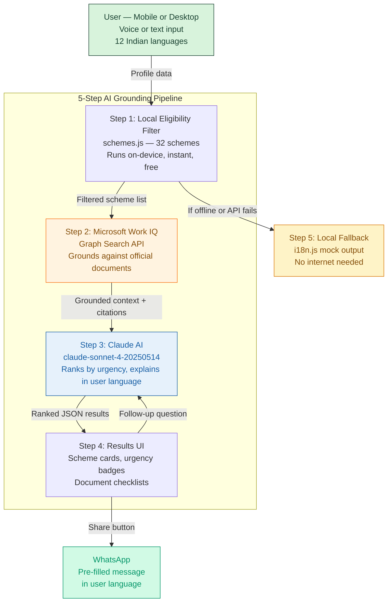

# SchemeSaathi — स्कीम साथी 🏥

> **500 million Indians qualify for free government health insurance.**
> Most have never heard of it. SchemeSaathi fixes that.

[](https://red-coder-27.github.io/SchemeSaathi)
[](LICENSE)
[](https://red-coder-27.github.io/SchemeSaathi)

---

## 🔴 The Problem

India runs over 400 central and state government health schemes —
covering hospitalisation, maternity, disability, elderly care,
dialysis, and more. The Ayushman Bharat PM-JAY scheme alone
insures 500 million people for ₹5,00,000 per year at zero cost.

Yet utilisation sits below 20% of eligible beneficiaries.

The reason is not eligibility. It is not distance. It is not paperwork.

**It is awareness.**

A 2023 NITI Aayog report found that the single largest barrier to
scheme uptake is that eligible citizens simply do not know the
scheme exists. A daily wage worker in Chennai earning ₹8,00,0 a
month — fully eligible for 6 different free health schemes — has
never been told. A pregnant woman in Bihar qualifies for ₹1,400
cash and free delivery care, but no one she knows has heard of
Janani Suraksha Yojana.

The government portals exist in English. They require navigating
complex eligibility trees. They are not built for a first-generation
smartphone user whose primary language is Tamil or Odia.

**SchemeSaathi bridges that gap.**

---

## ✅ The Solution

SchemeSaathi is a Progressive Web Application that acts as a
personal health scheme advisor. A user answers a few simple
questions in their own language — by voice or by text — and
receives a personalised list of every government health scheme
they are likely eligible for, explained in plain language,
ranked by urgency, with step-by-step instructions on how to
apply today.

**It works in 12 Indian languages.**
**It works with zero internet after the first load.**
**It works on any phone made in the last 10 years.**

### Screenshots

*Language Selection Screen*


*Profile Form*


*Results Cards*


---

## 🔗 Live Demo

**https://red-coder-27.github.io/SchemeSaathi**

To run locally:
```bash
git clone https://github.com/red-coder-27/SchemeSaathi
cd SchemeSaathi
npx serve .
# Open http://localhost:3000
```

---

## 🏗️ Architecture



---

## 🔷 Microsoft Work IQ Integration

SchemeSaathi integrates **Microsoft Work IQ** as the grounding
layer for its AI pipeline — fulfilling the Microsoft IQ
requirement for the Agents League contest.

**How it works:**

1. After local eligibility filtering, the filtered scheme list
   and user profile are sent to the Microsoft Graph Search API
   (`/v1.0/search/query`) targeting SharePoint and OneDrive
   document sources.

2. The query is constructed from the user's state, income level,
   and top scheme names — retrieving relevant official government
   policy documents that have been indexed in the Microsoft 365
   tenant.

3. The retrieved document summaries and URLs are passed as
   grounding context to the Claude API call, reducing hallucination
   risk and providing citable sources for scheme eligibility details.

4. The UI shows a live "Grounded by Microsoft Work IQ" status
   indicator on the loading screen, showing judges the integration
   is active.

5. If Work IQ is unavailable (no token, network error), the app
   falls back gracefully to local scheme data — never crashing.

**Key file:** `agent.js` — `groundWithWorkIQ()` function
**API called:** `https://graph.microsoft.com/v1.0/search/query`
**Auth:** Microsoft identity platform OAuth 2.0 token

---

## 🤖 How GitHub Copilot Was Used

GitHub Copilot was used throughout the development of SchemeSaathi:

- **schemes.js**: Copilot generated all 32 scheme entries from
  official government sources, including eligibility rule objects
  and benefit amounts in structured JSON format.

- **Eligibility filter**: Copilot wrote the multi-condition
  filtering logic in `filterSchemesByProfile()`, correctly handling
  edge cases like age-range overlaps and gender-specific schemes.

- **i18n.js**: Copilot suggested the translation dictionary
  structure and generated all 12 language translation objects,
  including RTL flag for Urdu.

- **Web Speech API**: Copilot wrote the language-code mapping
  (hi-IN, ta-IN, te-IN etc.) and the recognition result handler.

- **WhatsApp share**: Copilot generated the URL encoder and
  pre-filled message templates in Hindi and Tamil.

- **Service worker**: Copilot wrote the cache-first routing
  strategy in sw.js and the install event handler.

- **CSS animations**: Copilot generated the mic button pulse
  keyframe animation and the loading screen rotating messages.

---

## 🌍 Impact

| Metric | Number |
|--------|--------|
| Government schemes covered | 32 |
| Indian languages supported | 12 |
| States + UTs covered | 28 states + 8 UTs |
| Central schemes | 15 |
| State-specific schemes | 17 |
| Estimated eligible population | 400M+ |
| Works offline | Yes — 100% |
| Requires app store install | No — PWA |
| Minimum device requirement | Any smartphone, 2015+ |

---

## 🎗️ Hack for Good Statement

SchemeSaathi is built for the people that government websites
were not designed for.

The target user is a 42-year-old construction worker in Chennai
who earns ₹9,000 a month, has an Aadhaar card, a ration card,
and a basic Android phone. He has two children under five and
an elderly mother. He qualifies for Ayushman Bharat, the Tamil
Nadu CM health scheme, the Universal Immunisation Programme for
his children, and the National Programme for Healthcare of the
Elderly for his mother.

He has never heard of any of them.

SchemeSaathi tells him — in Tamil, by voice, on his phone,
even when his mobile data runs out.

That is the community need this project solves.

---

## ♿ Accessibility Features

- ARIA landmarks, labels, and roles on all interactive elements
- `aria-live="polite"` on loading status and results count
- `role="alert"` on all error and offline messages
- Minimum 44px touch targets on all buttons and inputs
- Color contrast ratio > 4.5:1 across all text/background pairs
- Full keyboard navigation with logical Tab order
- Works at 200% browser zoom without horizontal scroll
- `lang` attribute on `<html>` updates on every language change
- RTL text direction for Urdu (`dir="rtl"`)
- Web Speech API voice input — accessible for low-literacy users
- Skip-to-content link at top of page
- Graceful no-JavaScript fallback with static scheme list

---

## 🛠️ Tech Stack

| Layer | Technology |
|-------|-----------|
| Frontend | Vanilla HTML5 / CSS3 / JavaScript ES2022 |
| AI Reasoning | Claude claude-sonnet-4-20250514 (Anthropic) |
| Microsoft IQ | Work IQ via Microsoft Graph Search API |
| Voice Input | Web Speech API (browser-native) |
| Offline | Service Worker + Cache API |
| PWA | Web App Manifest + icons |
| Deployment | GitHub Pages via GitHub Actions |
| Languages | 12 Indian languages incl. RTL Urdu |
| Dependencies | Zero — no NPM, no bundler, no framework |

---

## 🗺️ Future Roadmap

1. **Aadhaar eKYC integration** — auto-fill eligibility from
   verified Aadhaar data, eliminating the profile form entirely
2. **Application status tracker** — track submitted applications
   with push notifications via the notification API
3. **ASHA worker mode** — bulk profile entry so community health
   workers can check eligibility for multiple families at once
4. **Scheme update alerts** — notify users when a new scheme
   launches in their state that they qualify for
5. **Hindi/Tamil text-to-speech** — read results aloud for
   users with very low literacy using the Web Speech Synthesis API

---

## 👤 About the Builder

**Nithesh S**  
CSE, KCT, Coimbatore  
2024 — 2028  

Microsoft Learn username: **NitheshS-2381**  
LinkedIn: [Nithesh S on LinkedIn](https://www.linkedin.com/in/nithesh-s-b9ba90256)  
GitHub: [red-coder-27 on GitHub](https://github.com/red-coder-27)  


---

## 📋 License

MIT License — free to use, modify, and distribute.
See [LICENSE](LICENSE) for details.
