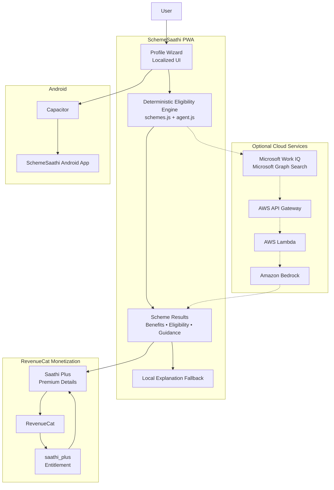

# SchemeSaathi

> An accessible AI-assisted government health-scheme discovery and eligibility assistant that helps people understand which schemes they may qualify for and how to apply.

[](https://red-coder-27.github.io/SchemeSaathi)
[](LICENSE)
[](https://red-coder-27.github.io/SchemeSaathi)

## Overview

SchemeSaathi is a vanilla HTML, CSS, and JavaScript Progressive Web App for discovering government health schemes. Users complete a short profile in a supported Indian language, receive locally filtered scheme matches, and can review plain-language benefits, urgency, and application guidance.

The project combines an on-device deterministic eligibility engine with optional Microsoft Work IQ grounding and an optional AWS API Gateway, Lambda, and Amazon Bedrock reasoning path. If the network or optional services are unavailable, the local eligibility and explanation flow continues to work.

## The Problem

Government health schemes can be difficult to discover and understand, especially when eligibility rules, documents, and application steps are spread across different portals and languages. SchemeSaathi turns a multi-step eligibility search into a guided profile flow designed for mobile use.

## The Solution

SchemeSaathi:

- Collects profile information through a four-step wizard.
- Filters schemes locally using age, income, gender, documents, employment, and health-needs conditions.
- Presents matched schemes with benefits, urgency indicators, and official links.
- Provides optional AI-assisted explanations and follow-up chat.
- Supports text and browser voice input.
- Supports 12 Indian languages, including RTL handling for Urdu.
- Runs as an installable PWA with a service-worker offline fallback.

Eligibility is determined by the local filtering engine. The language model does not decide whether a user qualifies.

## Key Features

- Personalized government health-scheme discovery.
- Deterministic, on-device eligibility filtering in `schemes.js` and `agent.js`.
- Plain-language localized results and statutory eligibility disclaimers.
- Optional Work IQ document grounding through Microsoft Graph Search.
- Optional AWS Bedrock reasoning through `/api/explain` and `/api/chat`.
- Local fallback explanations when the backend is not configured or reachable.
- Voice profile input and voice chat input through the browser Web Speech API.
- Official website links and WhatsApp sharing for matched schemes.
- Offline-aware PWA behavior through `sw.js` and the Cache API.

## Saathi Plus — RevenueCat Monetization

Saathi Plus adds a premium information layer while keeping the basic eligibility experience available to everyone.

| Free experience | Saathi Plus experience |
|---|---|
| Complete the profile and run eligibility checking | See all matched schemes |
| See basic eligible scheme cards | See detailed “Why you qualify” reasoning |
| Review essential scheme information | See required documents and application guidance |
| Open official scheme links | Access the additional detail already produced by SchemeSaathi |

The Android app uses `@revenuecat/purchases-capacitor` and the RevenueCat Test Store for the prototype purchase flow. The entitlement is:

- Display name: `Saathi Plus`
- Identifier: `saathi_plus`
- Test Store packages: Monthly, Yearly, Lifetime

The client checks RevenueCat Customer Info rather than treating a local boolean as the source of truth. Premium content is unlocked when `customerInfo.entitlements.active["saathi_plus"]` is active. The implementation supports loading offerings, purchasing a package, and restoring purchases. The purchase UI displays the current offering dynamically; it does not fabricate products when offerings are unavailable.

```text
User opens SchemeSaathi
        |
Eligibility profile and local scheme matching
        |
Basic results are shown
        |
Premium details remain locked for free users
        |
User opens Unlock Saathi Plus
        |
RevenueCat offerings are loaded
        |
User selects a RevenueCat Test Store package
        |
RevenueCat purchase completes
        |
Customer Info is refreshed
        |
saathi_plus entitlement is checked
        |
Existing premium result content is unlocked
```

The current prototype uses a client-side public RevenueCat SDK configuration. No RevenueCat secret API key or other private credential belongs in this repository or README.

## Android App

The existing PWA frontend is packaged as an Android application with Capacitor.

| Setting | Value |
|---|---|
| App name | SchemeSaathi |
| App ID | `com.schemesaathi.app` |
| Web directory | `www` |
| Android project | `android/` |
| Debug APK output | `android/app/build/outputs/apk/debug/app-debug.apk` |

The Android debug build has been verified with the repository’s Gradle project. This repository does not contain an iOS platform project, and the app is not described as published to an app store.

## Architecture

The current architecture remains a vanilla PWA plus optional serverless services and a Capacitor Android shell:


```mermaid
flowchart TD
        U[User]

        subgraph PWA["SchemeSaathi PWA"]
                UI["Profile Wizard<br/>Localized UI"]
                EL["Deterministic Eligibility Engine<br/>schemes.js + agent.js"]
                RESULTS["Scheme Results<br/>Benefits • Eligibility • Guidance"]
                FALLBACK["Local Explanation Fallback"]
        end

        subgraph CLOUD["Optional Cloud Services"]
                WORKIQ["Microsoft Work IQ<br/>Microsoft Graph Search"]
                API["AWS API Gateway"]
                LAMBDA["AWS Lambda"]
                BEDROCK["Amazon Bedrock"]
        end

        subgraph MONETIZATION["RevenueCat Monetization"]
                RC["RevenueCat"]
                ENT["saathi_plus<br/>Entitlement"]
                PREMIUM["Saathi Plus<br/>Premium Details"]
        end

        subgraph ANDROID["Android"]
                CAP["Capacitor"]
                APP["SchemeSaathi Android App"]
        end

        U --> UI
        UI --> EL
        EL --> RESULTS

        EL -.-> WORKIQ
        WORKIQ -.-> API
        API -.-> LAMBDA
        LAMBDA -.-> BEDROCK
        BEDROCK -.-> RESULTS

        RESULTS --> FALLBACK
        RESULTS --> PREMIUM

        PREMIUM --> RC
        RC --> ENT
        ENT --> PREMIUM

        UI --> CAP
        CAP --> APP
```

The local eligibility engine is authoritative for eligibility. Optional cloud services provide grounding, reasoning, and chat responses. RevenueCat manages the Saathi Plus purchase and entitlement state, while Capacitor packages the existing web application as an Android app.

## Technology Stack

| Layer | Technology used in this repository |
|---|---|
| Frontend | Vanilla HTML5, CSS3, and browser JavaScript |
| PWA | Web App Manifest, service worker, Cache API, and icons |
| Eligibility | Local deterministic JavaScript engine and structured scheme data |
| AI backend | AWS Lambda with Node.js 20.x, API Gateway, and Amazon Bedrock Converse API |
| Grounding | Optional Microsoft Graph Search API / Work IQ integration |
| Voice | Browser Web Speech API |
| Android | Capacitor Android and Gradle |
| Monetization | `@revenuecat/purchases-capacitor` 13.7.0 |
| Infrastructure | AWS SAM template and Amplify hosting configuration |

## Accessibility and Localization

The UI includes a skip-to-content link, labeled controls, dialog roles, live regions for loading/status content, alert semantics for offline status, keyboard focus styling, and reduced-motion handling. The document language is updated when the user changes language, and Urdu switches the document direction to RTL.

The language selector contains 12 languages: Hindi, English, Tamil, Telugu, Kannada, Malayalam, Marathi, Bengali, Gujarati, Odia, Punjabi, and Urdu. Voice input uses language-specific browser recognition codes where supported. Browser and device support for speech recognition can vary.

## Project Structure

```text
.
├── index.html                 # PWA UI and app orchestration
├── styles.css                 # SchemeSaathi visual system and responsive UI
├── agent.js                   # Eligibility, grounding, reasoning, chat, and fallback logic
├── schemes.js                 # Government scheme data and eligibility rules
├── i18n.js                    # Language data and translations
├── revenuecat.js              # Native-only RevenueCat adapter and entitlement checks
├── manifest.json              # PWA metadata
├── sw.js                      # Offline caching and fetch behavior
├── icons/                     # PWA icons
├── backend/                   # Lambda, SAM template, policy, and backend test
├── tests/                     # Frontend eligibility/fallback test suite
├── www/                       # Capacitor web assets mirrored from the source frontend
├── android/                   # Capacitor Android project
├── capacitor.config.json      # Capacitor app configuration
├── architecture.md            # Detailed system and AWS architecture notes
├── amplify.yml                # Static hosting configuration
└── package.json               # Capacitor and RevenueCat dependencies
```

## Getting Started

### PWA

Prerequisites: Node.js and npm.

```bash
git clone https://github.com/red-coder-27/SchemeSaathi
cd SchemeSaathi
npm install
npx serve .
```

Open the local URL printed by `serve` in a browser. The live demo is available at [red-coder-27.github.io/SchemeSaathi](https://red-coder-27.github.io/SchemeSaathi).

### Android

After installing dependencies, synchronize the web assets and native plugins:

```bash
npx cap sync android
```

Windows:

```powershell
cd android
.\gradlew.bat assembleDebug
```

macOS/Linux:

```bash
cd android
./gradlew assembleDebug
```

The generated debug APK is located at `android/app/build/outputs/apk/debug/app-debug.apk`.

## RevenueCat Development and Testing

The hackathon implementation uses RevenueCat Test Store packages, not production payments. The adapter in `revenuecat.js`:

1. Initializes RevenueCat only in the native Capacitor environment.
2. Configures the Purchases plugin with the client-side public SDK key.
3. Loads the current offering.
4. Reads Customer Info and checks the `saathi_plus` entitlement.
5. Purchases the selected offering package.
6. Refreshes entitlement state after purchase.
7. Restores purchases and checks the entitlement again.

The RevenueCat dashboard must provide the `saathi_plus` entitlement and its current Test Store offering. The web/PWA mode does not attempt native purchases and continues with the free experience.

## Testing and Verification

The repository’s frontend test file is `tests/test_suite.js`. Because the root `package.json` currently has a placeholder `npm test` script, run the existing suite directly:

PowerShell:

```powershell
Get-Content .\tests\test_suite.js -Raw | node --input-type=module
```

The suite covers scheme data, deterministic eligibility cases, local fallback responses, localized greetings, disclaimers, and follow-up chat fallback behavior.

The Android debug build and Capacitor synchronization have been verified during development. RevenueCat Test Store purchase completion and entitlement activation were verified on a physical Android device. Restore and cancellation remain manual device-flow checks.

## Demo and Links

- Live demo: [red-coder-27.github.io/SchemeSaathi](https://red-coder-27.github.io/SchemeSaathi)
- Repository: [github.com/red-coder-27/SchemeSaathi](https://github.com/red-coder-27/SchemeSaathi)
- Builder: [Nithesh S on LinkedIn](https://www.linkedin.com/in/nithesh-s-b9ba90256)
- GitHub profile: [red-coder-27](https://github.com/red-coder-27)

## Shipaton 2026 — Next Gen

SchemeSaathi is being submitted under the Next Gen/student category. The submission extends the existing PWA into an Android app with Capacitor and adds RevenueCat-powered Saathi Plus monetization. RevenueCat Test Store is used for the prototype purchase flow, with the `saathi_plus` entitlement controlling access to the existing premium result details.

## About the Builder

**Nithesh S**  
CSE, KCT, Coimbatore  
2024 — 2028

Microsoft Learn username: **NitheshS-2381**

## License

MIT License — free to use, modify, and distribute. See [LICENSE](LICENSE) for details.
