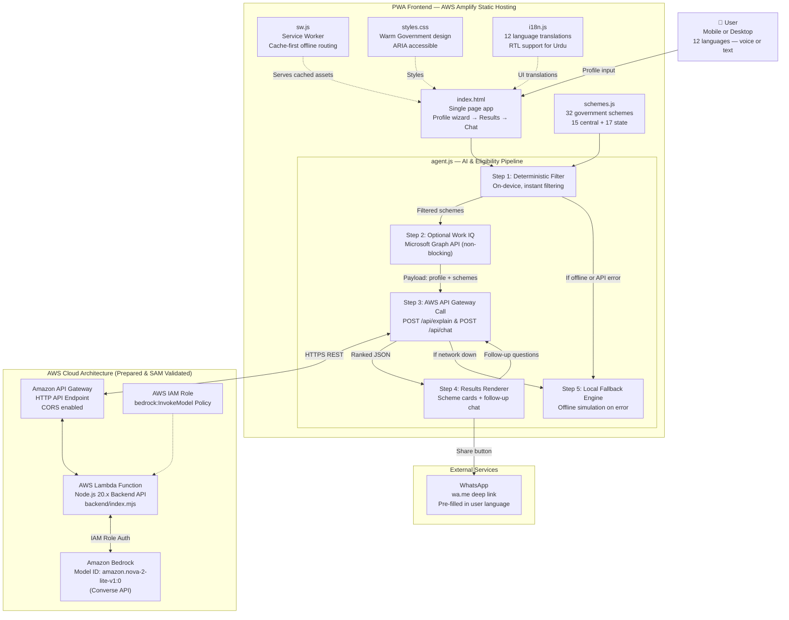

# SchemeSaathi — AWS Architecture & System Overview

## System Overview

SchemeSaathi is a Progressive Web Application (PWA) combined with a serverless AWS backend built for the **AWS Summer Builds Showcase Challenge 2026**.

Deployment Readiness Status:
- **AWS Amplify Hosting (Frontend PWA)**: Ready for immediate static hosting deployment (`amplify.yml` included).
- **AWS Serverless Backend (Lambda + API Gateway + Bedrock)**: Backend code (`backend/index.mjs`), IAM policy (`backend/policy.json`), and Infrastructure-as-Code (`backend/template.yaml`) are fully validated locally (`sam build` and `sam validate`). Live cloud invocation remains pending AWS account model access verification.
- **Authoritative Deterministic Eligibility**: Scheme eligibility is filtered 100% locally on-device via `filterSchemesByProfile()`. The LLM **NEVER** decides eligibility.
- **Zero Client-Side Credentials**: No API keys or AWS credentials are stored in browser memory, `localStorage`, or client code. Authentication with Amazon Bedrock uses IAM Roles (`bedrock:InvokeModel`).
- **Offline Resilient**: If offline or if the cloud API backend is unreachable, the PWA falls back instantly to the local on-device smart explanation engine.

## Architecture Diagram



## Data Flow — Single User Journey

1. **Static Asset Load**: PWA loads static shell (`index.html`, `styles.css`, `schemes.js`, `i18n.js`, `agent.js`) from cache via Service Worker (`sw.js`).
2. **Profile Submission**: User completes 4-step wizard form (language, location, economic details, health needs, documents).
3. **Step 1 (Deterministic Filtering)**: `filterSchemesByProfile()` runs locally against `SCHEMES` dataset in `schemes.js` (~10ms).
4. **Step 2 (Work IQ Grounding - Optional)**: `groundWithWorkIQ()` queries official document indexes if token is configured; gracefully skips if unconfigured.
5. **Step 3 (AWS Cloud AI Reasoning)**: `explainWithClaude()` sends candidate schemes, user profile, and language to AWS API Gateway (`POST /api/explain`).
6. **Step 4 (AWS Lambda & Amazon Bedrock)**:
   - API Gateway forwards event to Lambda (`backend/index.mjs`).
   - Lambda validates payload and calls Amazon Bedrock using `ConverseCommand` via AWS SDK.
   - Bedrock returns structured JSON containing greetings, urgency scores, explanations, immediate actions, and disclaimers.
7. **Step 5 (UI Rendering)**: PWA renders scheme cards, urgency badges, document checklists, and WhatsApp share links.
8. **Step 6 (Follow-Up Chat)**: Post-results questions are posted to `/api/chat` and answered by Bedrock.
9. **Offline Fallback**: If network is disconnected or API is unreachable, `buildSmartLocalResponse()` generates instant localized results on-device.

## Backend File Structure

```text
backend/
├── index.mjs           # AWS Lambda Handler (Amazon Bedrock Converse API integration)
├── template.yaml       # AWS SAM Infrastructure-as-Code template
├── policy.json         # IAM execution role policy for Bedrock invocation
├── package.json        # Node.js dependencies
└── test_local.js       # Local unit test runner for Lambda handler
```

## Security Notes

- **Zero Client-Side Secrets**: Browser never sees or stores AWS credentials or Anthropic API keys.
- **IAM Role Authentication**: AWS Lambda authenticates to Bedrock using IAM execution role permissions (`bedrock:InvokeModel`).
- **No Data Retention**: User profile data exists only in transient memory during request processing.
- **CORS Protection**: API Gateway restricts allowed HTTP methods (`POST`, `OPTIONS`) and origin headers.
- **Statutory Disclaimers**: Disclaimers are enforced at both frontend and Lambda system prompt levels.
